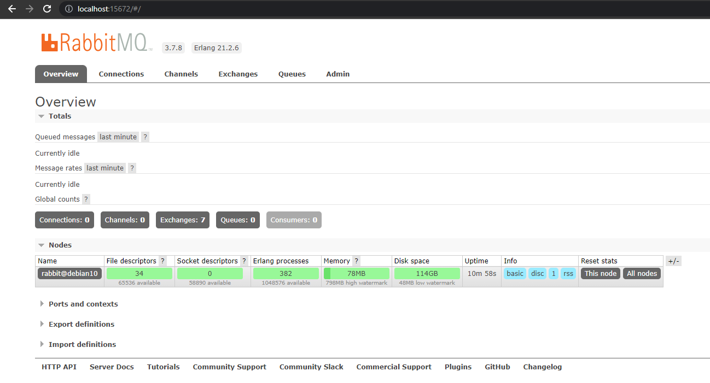
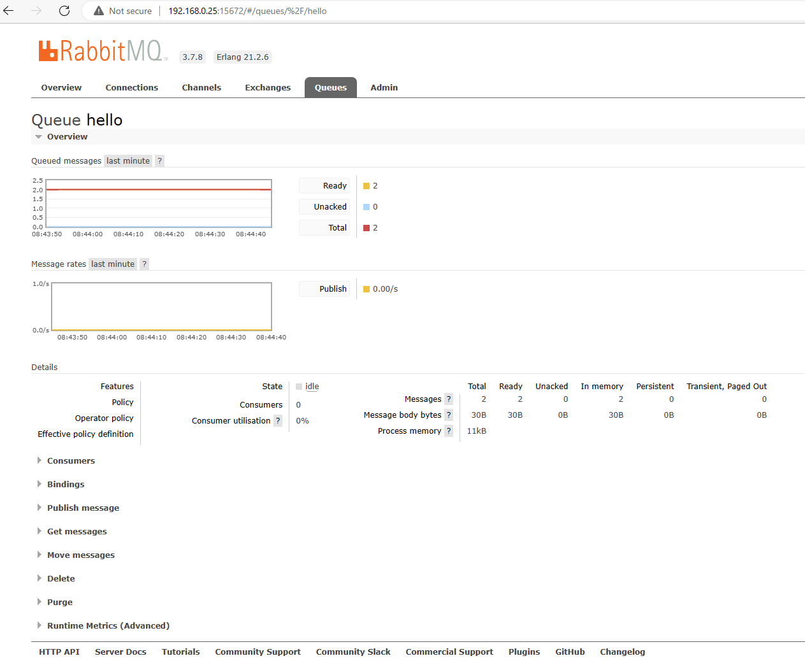
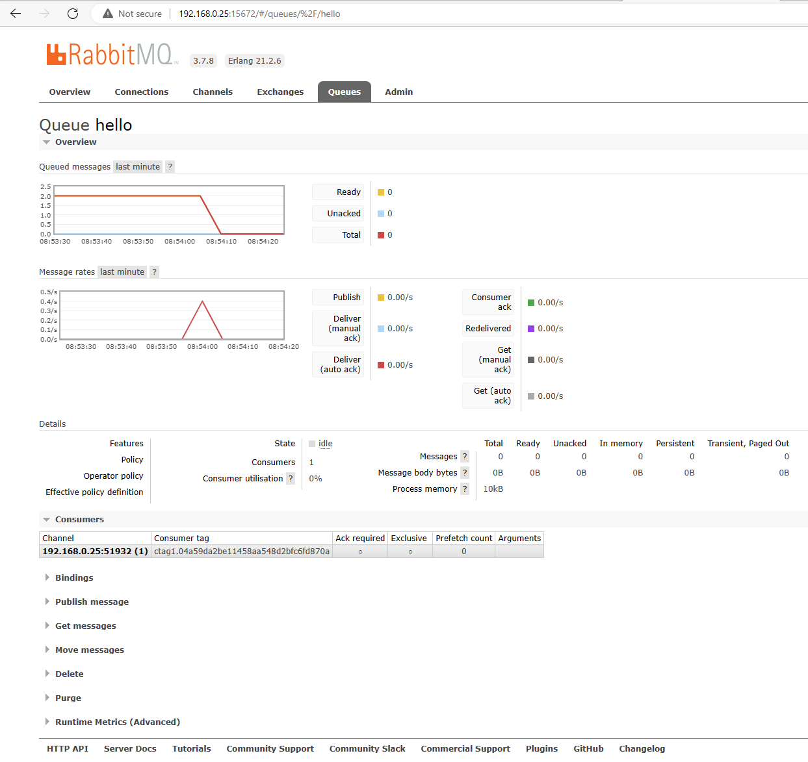
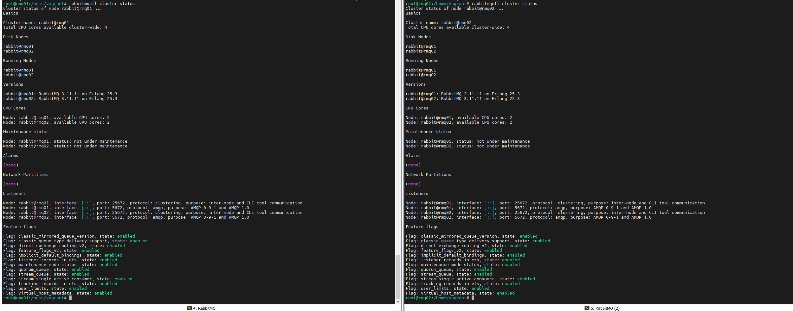
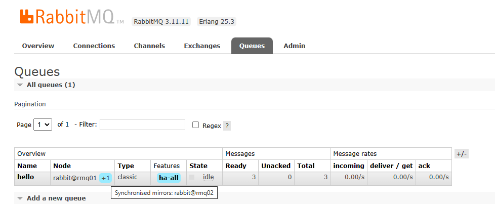
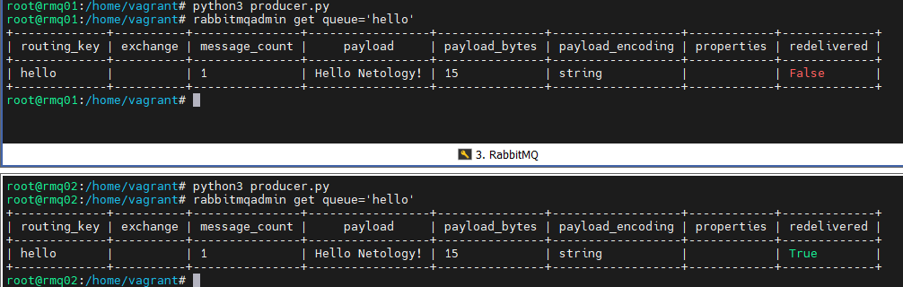
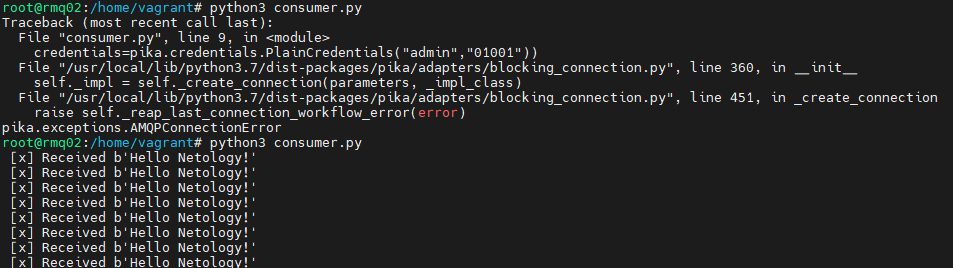
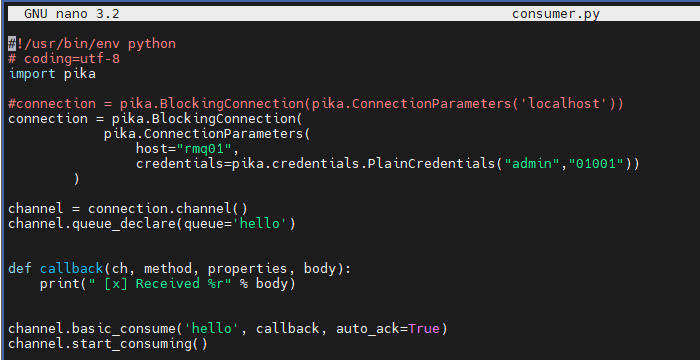
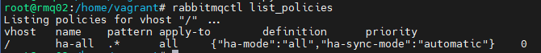

# Домашнее задание к занятию 11.4. «Очереди RabbitMQ»

---
### Задание 1. Установка RabbitMQ

Используя Vagrant или VirtualBox, создайте виртуальную машину и установите RabbitMQ.
Добавьте management plug-in и зайдите в веб-интерфейс.

*Итогом выполнения домашнего задания будет приложенный скриншот веб-интерфейса RabbitMQ.*
`
---

### Задание 2. Отправка и получение сообщений

Используя приложенные скрипты, проведите тестовую отправку и получение сообщения.
Для отправки сообщений необходимо запустить скрипт producer.py.

Для работы скриптов вам необходимо установить Python версии 3 и библиотеку Pika.
Также в скриптах нужно указать IP-адрес машины, на которой запущен RabbitMQ, заменив localhost на нужный IP.

```shell script
$ pip install pika
```

Зайдите в веб-интерфейс, найдите очередь под названием hello и сделайте скриншот.
После чего запустите второй скрипт consumer.py и сделайте скриншот результата выполнения скрипта

`
`

---

### Задание 3. Подготовка HA кластера

Используя Vagrant или VirtualBox, создайте вторую виртуальную машину и установите RabbitMQ.
Добавьте в файл hosts название и IP-адрес каждой машины, чтобы машины могли видеть друг друга по имени.

Пример содержимого hosts файла:
```shell script
$ cat /etc/hosts
192.168.0.10 rmq01
192.168.0.11 rmq02
```
После этого ваши машины могут пинговаться по имени.

Затем объедините две машины в кластер и создайте политику ha-all на все очереди.

*В качестве решения домашнего задания приложите скриншоты из веб-интерфейса с информацией о доступных нодах в кластере и включённой политикой.*

Также приложите вывод команды с двух нод:

```shell script
$ rabbitmqctl cluster_status
```
`
`
Для закрепления материала снова запустите скрипт producer.py и приложите скриншот выполнения команды на каждой из нод:

```shell script
$ rabbitmqadmin get queue='hello'
```
`

После чего попробуйте отключить одну из нод, желательно ту, к которой подключались из скрипта, затем поправьте параметры подключения в скрипте consumer.py на вторую ноду и запустите его.

*Приложите скриншот результата работы второго скрипта.*

При выключении первой ноды и попытке забрать очередь выводит ошибку.
`
Настройки consumer.py
`
rabbitmqctl list_policies
`


### * Задание 4. Ansible playbook

Напишите плейбук, который будет производить установку RabbitMQ на любое количество нод и объединять их в кластер.
При этом будет автоматически создавать политику ha-all.

*Готовый плейбук разместите в своём репозитории.*

