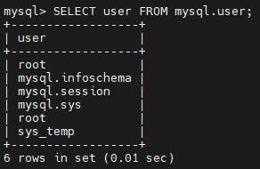
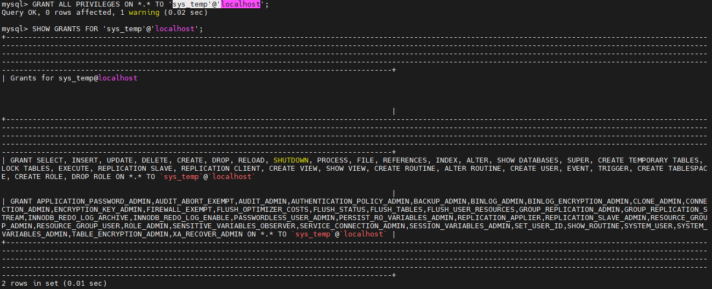
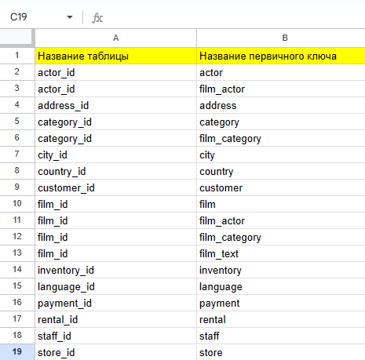

# Домашнее задание к занятию 12.2. «Работа с данными (DDL/DML)»


Задание можно выполнить как в любом IDE, так и в командной строке.

### Задание 1
1.1. Поднимите чистый инстанс MySQL версии 8.0+. Можно использовать локальный сервер или контейнер Docker.

1.2. Создайте учётную запись sys_temp. 

1.3. Выполните запрос на получение списка пользователей в базе данных. (скриншот)

`

1.4. Дайте все права для пользователя sys_temp. 

1.5. Выполните запрос на получение списка прав для пользователя sys_temp. (скриншот)

`

1.6. Переподключитесь к базе данных от имени sys_temp.

Для смены типа аутентификации с sha2 используйте запрос: 
```sql
ALTER USER 'sys_test'@'localhost' IDENTIFIED WITH mysql_native_password BY 'password';
```
1.6. По ссылке https://downloads.mysql.com/docs/sakila-db.zip скачайте дамп базы данных.

1.7. Восстановите дамп в базу данных.

1.8. При работе в IDE сформируйте ER-диаграмму получившейся базы данных. При работе в командной строке используйте команду для получения всех таблиц базы данных. (скриншот)

*Результатом работы должны быть скриншоты обозначенных заданий, а также простыня со всеми запросами.*

```bash
bash-4.4# mysql -u root -p

mysql> CREATE USER 'sys_temp'@'localhost' IDENTIFIED BY '01001';
Query OK, 0 rows affected (0.17 sec)

mysql> SELECT user FROM mysql.user;
+------------------+
| user             |
+------------------+
| root             |
| mysql.infoschema |
| mysql.session    |
| mysql.sys        |
| root             |
| sys_temp         |
+------------------+
6 rows in set (0.01 sec)

mysql>
mysql> GRANT ALL PRIVILEGES ON *.* TO 'sys_temp'@'localhost';
Query OK, 0 rows affected, 1 warning (0.02 sec)

mysql> SHOW GRANTS FOR 'sys_temp'@'localhost';
+------------------------------------------------------------------------------------------------------------------------------------------------------------------------------------------------------------------------------------------------------------------------------------------------------------------------------------------------------------------------------------------------------------------------------------------------------------------------------------------------------------------------------------------------------------------------------------------------------------------------------------------------------------------------------------------------------------------------------------------------------------+
| Grants for sys_temp@localhost                                                                                                                                                                                                                                                                                                                                                                                                                                                                                                                                                                                                                                                                                                                              |
+------------------------------------------------------------------------------------------------------------------------------------------------------------------------------------------------------------------------------------------------------------------------------------------------------------------------------------------------------------------------------------------------------------------------------------------------------------------------------------------------------------------------------------------------------------------------------------------------------------------------------------------------------------------------------------------------------------------------------------------------------------+
| GRANT SELECT, INSERT, UPDATE, DELETE, CREATE, DROP, RELOAD, SHUTDOWN, PROCESS, FILE, REFERENCES, INDEX, ALTER, SHOW DATABASES, SUPER, CREATE TEMPORARY TABLES, LOCK TABLES, EXECUTE, REPLICATION SLAVE, REPLICATION CLIENT, CREATE VIEW, SHOW VIEW, CREATE ROUTINE, ALTER ROUTINE, CREATE USER, EVENT, TRIGGER, CREATE TABLESPACE, CREATE ROLE, DROP ROLE ON *.* TO `sys_temp`@`localhost`                                                                                                                                                                                                                                                                                                                                                                 |
| GRANT APPLICATION_PASSWORD_ADMIN,AUDIT_ABORT_EXEMPT,AUDIT_ADMIN,AUTHENTICATION_POLICY_ADMIN,BACKUP_ADMIN,BINLOG_ADMIN,BINLOG_ENCRYPTION_ADMIN,CLONE_ADMIN,CONNECTION_ADMIN,ENCRYPTION_KEY_ADMIN,FIREWALL_EXEMPT,FLUSH_OPTIMIZER_COSTS,FLUSH_STATUS,FLUSH_TABLES,FLUSH_USER_RESOURCES,GROUP_REPLICATION_ADMIN,GROUP_REPLICATION_STREAM,INNODB_REDO_LOG_ARCHIVE,INNODB_REDO_LOG_ENABLE,PASSWORDLESS_USER_ADMIN,PERSIST_RO_VARIABLES_ADMIN,REPLICATION_APPLIER,REPLICATION_SLAVE_ADMIN,RESOURCE_GROUP_ADMIN,RESOURCE_GROUP_USER,ROLE_ADMIN,SENSITIVE_VARIABLES_OBSERVER,SERVICE_CONNECTION_ADMIN,SESSION_VARIABLES_ADMIN,SET_USER_ID,SHOW_ROUTINE,SYSTEM_USER,SYSTEM_VARIABLES_ADMIN,TABLE_ENCRYPTION_ADMIN,XA_RECOVER_ADMIN ON *.* TO `sys_temp`@`localhost` |
+------------------------------------------------------------------------------------------------------------------------------------------------------------------------------------------------------------------------------------------------------------------------------------------------------------------------------------------------------------------------------------------------------------------------------------------------------------------------------------------------------------------------------------------------------------------------------------------------------------------------------------------------------------------------------------------------------------------------------------------------------------+
2 rows in set (0.01 sec)


bash-4.4# mysql -u sys_temp -p
Enter password:
Welcome to the MySQL monitor.  Commands end with ; or \g.
Your MySQL connection id is 14
Server version: 8.0.32 MySQL Community Server - GPL

Copyright (c) 2000, 2023, Oracle and/or its affiliates.

Oracle is a registered trademark of Oracle Corporation and/or its
affiliates. Other names may be trademarks of their respective
owners.

Type 'help;' or '\h' for help. Type '\c' to clear the current input statement.


mysql> SOURCE /sakila-schema.sql;

mysql> SOURCE /sakila-data.sql;

mysql> USE sakila
Database changed
mysql> SHOW FULL TABLES;
+----------------------------+------------+
| Tables_in_sakila           | Table_type |
+----------------------------+------------+
| actor                      | BASE TABLE |
| actor_info                 | VIEW       |
| address                    | BASE TABLE |
| category                   | BASE TABLE |
| city                       | BASE TABLE |
| country                    | BASE TABLE |
| customer                   | BASE TABLE |
| customer_list              | VIEW       |
| film                       | BASE TABLE |
| film_actor                 | BASE TABLE |
| film_category              | BASE TABLE |
| film_list                  | VIEW       |
| film_text                  | BASE TABLE |
| inventory                  | BASE TABLE |
| language                   | BASE TABLE |
| nicer_but_slower_film_list | VIEW       |
| payment                    | BASE TABLE |
| rental                     | BASE TABLE |
| sales_by_film_category     | VIEW       |
| sales_by_store             | VIEW       |
| staff                      | BASE TABLE |
| staff_list                 | VIEW       |
| store                      | BASE TABLE |
+----------------------------+------------+
23 rows in set (0.01 sec)


```

### Задание 2
Составьте таблицу, используя любой текстовый редактор или Excel, в которой должно быть два столбца: в первом должны быть названия таблиц восстановленной базы, во втором названия первичных ключей этих таблиц. Пример: (скриншот/текст)
```
Название таблицы | Название первичного ключа
customer         | customer_id
```
`

## Дополнительные задания (со звёздочкой*)
Эти задания дополнительные, то есть не обязательные к выполнению, и никак не повлияют на получение вами зачёта по этому домашнему заданию. Вы можете их выполнить, если хотите глубже шире разобраться в материале.

### Задание 3*
3.1. Уберите у пользователя sys_temp права на внесение, изменение и удаление данных из базы sakila.

3.2. Выполните запрос на получение списка прав для пользователя sys_temp. (скриншот)

*Результатом работы должны быть скриншоты обозначенных заданий, а также простыня со всеми запросами.*
