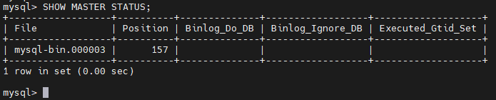
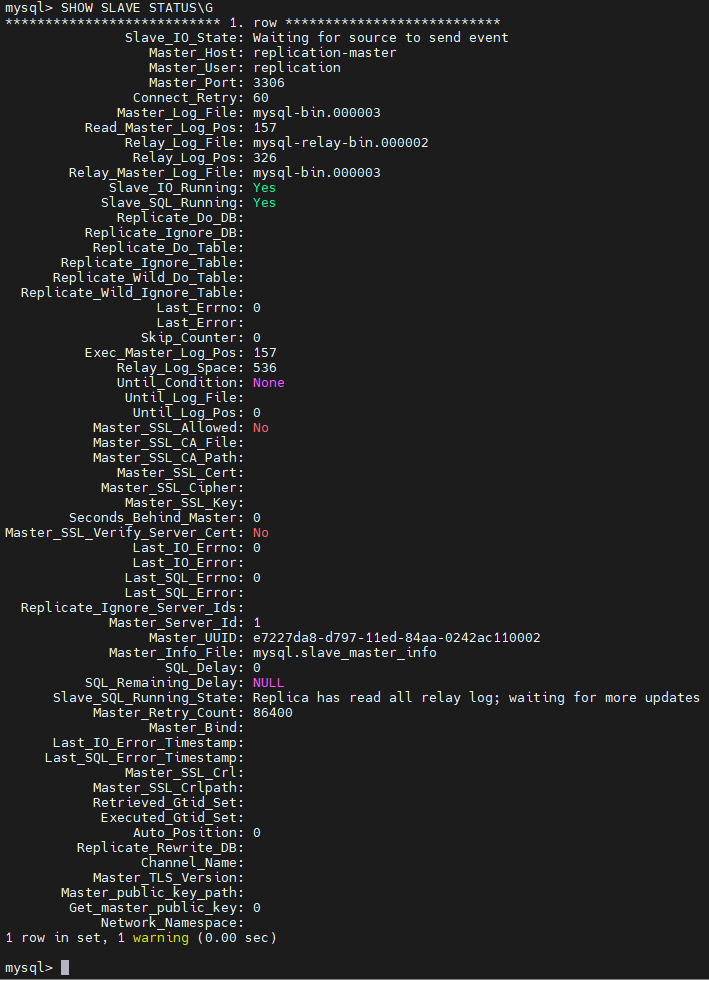

# Домашнее задание к занятию 12.6. «Репликация и масштабирование. Часть 1»

### Задание 1

На лекции рассматривались режимы репликации master-slave, master-master, опишите их различия.

Master-slave репликация является наиболее распространенной формой репликации в MySQL. В этом типе репликации одна база данных (master) является первичным источником данных, а другая база данных (slave) является вторичным и получает копии данных из первичного источника. В этом случае записи могут быть выполнены только на мастер-сервере, а затем они будут реплицироваться на слейвы. Slave серверы могут использоваться для чтения данных, но они не могут записывать данные.

Master-master репликация позволяет двум или более серверам MySQL записывать данные друг в друга. Это означает, что каждый сервер может выполнять операции чтения и записи. В этом случае любой сервер может выступать в роли мастера, и любой мастер может записывать данные на любой другой мастер. Также важно отметить, что при использовании master-master репликации необходимо более тщательно настраивать конфликты записей, чтобы избежать проблемы в работе.

Основным преимуществом репликации в MySQL является возможность увеличения производительности и обеспечения более высокой доступности данных в системе. Однако, при использовании master-master репликации необходимо быть особенно внимательным, чтобы избежать конфликтов записей.

В режиме master-slave все изменения в БД возможны только на мастере, данные на слейве доступны только на чтение, также из-за особенности архитектуры слейв потребляет гораздо больше ресурсов чем мастер В режиме master-master каждый сервер является и мастером и слейвом.

---

### Задание 2

Выполните конфигурацию master-slave репликации, примером можно пользоваться из лекции.

*Приложите скриншоты конфигурации, выполнения работы: состояния и режимы работы серверов.*
`
`
---

## Дополнительные задания (со звёздочкой*)
Эти задания дополнительные, то есть не обязательные к выполнению, и никак не повлияют на получение вами зачёта по этому домашнему заданию. Вы можете их выполнить, если хотите глубже шире разобраться в материале.

---

### Задание 3* 

Выполните конфигурацию master-master репликации. Произведите проверку.

*Приложите скриншоты конфигурации, выполнения работы: состояния и режимы работы серверов.*
