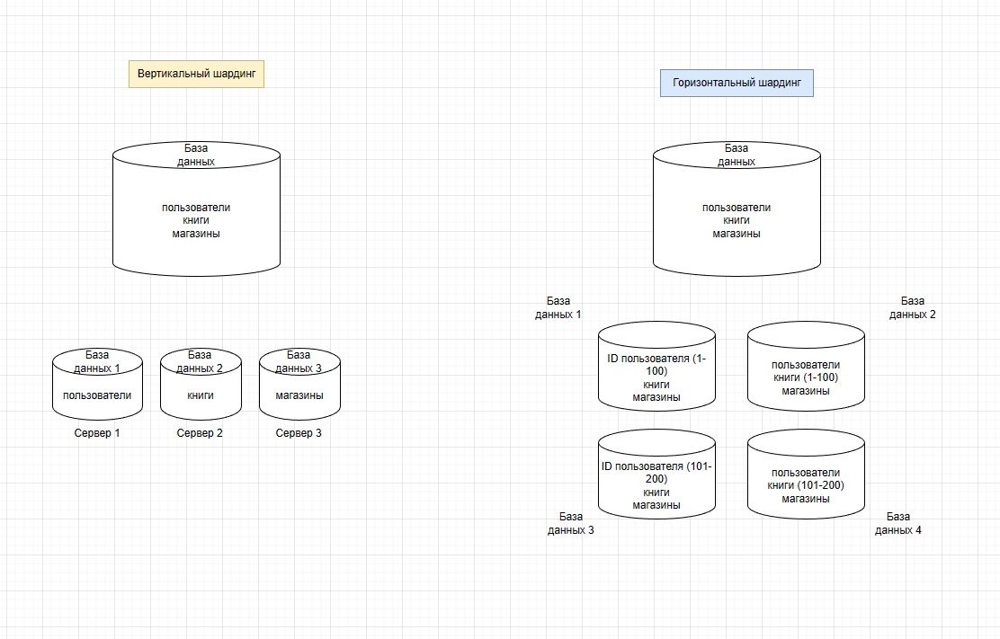

# Домашнее задание к занятию 12.7. «Репликация и масштабирование. Часть 2»

### Задание 1

Опишите основные преимущества использования масштабирования методами:

- активный master-сервер и пассивный репликационный slave-сервер; 
- master-сервер и несколько slave-серверов;
- активный сервер со специальным механизмом репликации — distributed replicated block device (DRBD);
- SAN-кластер.

*Дайте ответ в свободной форме.*

Активный master-сервер и пассивный репликационный slave-сервер:
Этот метод масштабирования позволяет использовать один сервер в качестве мастер-сервера, который обрабатывает все запросы от клиентов и записывает данные на жесткий диск. В то же время, пассивный slave-сервер реплицирует данные с мастер-сервера и может быстро заменить мастер-сервер в случае его отказа. Основное преимущество этого метода заключается в том, что он обеспечивает высокую доступность и отказоустойчивость системы при низких затратах на оборудование.

Master-сервер и несколько slave-серверов:
Этот метод масштабирования позволяет распределить нагрузку на несколько серверов, каждый из которых может выполнять определенную функцию. Master-сервер может быть использован для обработки запросов, а slave-серверы могут использоваться для хранения данных и выполнения других задач. При этом все серверы работают в синхронном режиме, что позволяет обеспечить высокую доступность и отказоустойчивость системы. Основное преимущество этого метода заключается в том, что он обеспечивает высокую производительность и гибкость системы.

Активный сервер со специальным механизмом репликации — distributed replicated block device (DRBD):
DRBD - это механизм репликации блочных устройств, который позволяет создавать реплицированные тома данных между серверами. В этом методе один сервер является активным, а второй - пассивным, который автоматически становится активным в случае отказа первого сервера. Основное преимущество этого метода заключается в том, что он обеспечивает высокую доступность и отказоустойчивость данных при низких затратах на оборудование.

SAN-кластер:
Этот метод масштабирования представляет собой группу серверов, которые используют общий массив данных. В случае отказа одного сервера, другие серверы могут продолжать работу, используя общие данные. Основное преимущество этого метода заключается в том, что он обеспечивает высокую доступность и отказоустойчивость данных при высокой производительности системы. Однако данный метод требует высоких затрат на оборудование и сложную настрой

---

### Задание 2

Разработайте план для выполнения горизонтального и вертикального шаринга базы данных. База данных состоит из трёх таблиц: 

- пользователи, 
- книги, 
- магазины (столбцы произвольно). 

Опишите принципы построения системы и их разграничение или разбивку между базами данных.

*Пришлите блоксхему, где и что будет располагаться. Опишите, в каких режимах будут работать сервера.* 
`

Вертикальный шардинг - таблицы базы данных на отдельных серверах
Горизонтальный шардинг - таблицы пользователи и книги были разделены на 2 части и на 2 отдельных сервера

## Дополнительные задания (со звёздочкой*)
Эти задания дополнительные, то есть не обязательные к выполнению, и никак не повлияют на получение вами зачёта по этому домашнему заданию. Вы можете их выполнить, если хотите глубже шире разобраться в материале.

---
### Задание 3*

Выполните настройку выбранных методов шардинга из задания 2.

*Пришлите конфиг Docker и SQL скрипт с командами для базы данных*.
