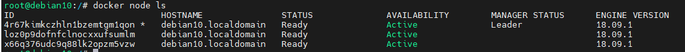
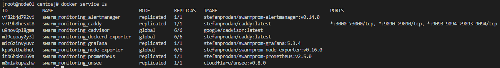

# Домашнее задание к занятию "5. Оркестрация кластером Docker контейнеров на примере Docker Swarm"

## Задача 1

Дайте письменые ответы на следующие вопросы:

- В чём отличие режимов работы сервисов в Docker Swarm кластере: replication и global?

```
Режим репликации создает указанное количество копий сервиса (тасков) на разных узлах кластера, что позволяет обеспечить отказоустойчивость и масштабируемость приложения. Если один из узлов выходит из строя, то остальные копии сервиса продолжают работу, и пользователи не замечают проблем. Режим репликации наиболее подходит для веб-приложений и других приложений, которые могут быть масштабированы горизонтально.

Режим глобального запуска (global mode) создает одну копию сервиса на каждом узле кластера. Это означает, что каждый узел кластера имеет полную копию сервиса, что позволяет легко масштабировать сервисы, такие как базы данных или другие приложения, которые должны быть на каждом узле кластера.
```
- Какой алгоритм выбора лидера используется в Docker Swarm кластере?
```
В Docker Swarm кластере используется алгоритм выбора лидера, который называется Raft. 

```

- Что такое Overlay Network?

```
Overlay Network (сеть оверлея) - это сеть, создаваемая поверх существующей инфраструктуры сети и используемая для связи между контейнерами и сервисами в распределенных системах, таких как Docker Swarm или Kubernetes.

Overlay Network позволяет контейнерам и сервисам взаимодействовать между собой, не зависимо от их расположения в сети, а также обеспечивает изоляцию трафика между разными сервисами. Контейнеры и сервисы могут связываться с другими контейнерами и сервисами в Overlay Network, используя DNS-имена или IP-адреса.

Overlay Network создается на основе Virtual Extensible LAN (VXLAN) или другого протокола виртуальной сети и обеспечивает масштабируемость и отказоустойчивость, позволяя легко добавлять или удалять узлы и контейнеры в сеть.

Docker Swarm позволяет создавать несколько Overlay Network для разных сервисов и приложений, что обеспечивает изоляцию трафика и повышает безопасность в распределенной системе.
```
## Задача 2

Создать ваш первый Docker Swarm кластер в Яндекс.Облаке

Для получения зачета, вам необходимо предоставить скриншот из терминала (консоли), с выводом команды:
```
docker node ls

root@debian10:/# docker node ls
ID                            HOSTNAME               STATUS              AVAILABILITY        MANAGER STATUS      ENGINE VERSION
4r67kimkczhln1bzemtgm1qon *   debian10.localdomain   Ready               Active              Leader              18.09.1
loz0p9dofnfclnocxxufsumlm     debian10.localdomain   Ready               Active                                  18.09.1
x66q376udc9q88lk2opzm5vzw     debian10.localdomain   Ready               Active                                  18.09.1

```



## Задача 3

Создать ваш первый, готовый к боевой эксплуатации кластер мониторинга, состоящий из стека микросервисов.

Для получения зачета, вам необходимо предоставить скриншот из терминала (консоли), с выводом команды:
```
docker service ls
```

## Задача 4 (*)

Выполнить на лидере Docker Swarm кластера команду (указанную ниже) и дать письменное описание её функционала, что она делает и зачем она нужна:
```
# см.документацию: https://docs.docker.com/engine/swarm/swarm_manager_locking/
docker swarm update --autolock=true
```
```
Флаг --autolock=true означает, что после обновления конфигурации Docker Swarm, менеджеры кластера будут заблокированы автоматически для изменений конфигурации. Это означает, что нельзя будет внести изменения в кластер до тех пор, пока блокировка не будет снята вручную с помощью команды "docker swarm unlock".

Это дополнительное средство безопасности, которое помогает предотвратить несанкционированные изменения в конфигурации Docker Swarm.
```

