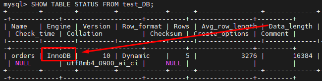
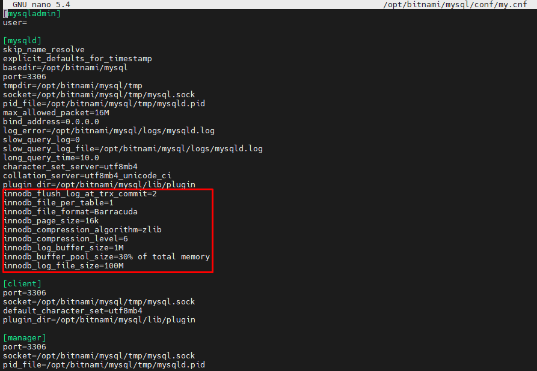

# Домашнее задание к занятию "3. MySQL"

## Введение

Перед выполнением задания вы можете ознакомиться с 
[дополнительными материалами](https://github.com/netology-code/virt-homeworks/blob/virt-11/additional/README.md).

## Задача 1

Используя docker поднимите инстанс MySQL (версию 8). Данные БД сохраните в volume.

Изучите [бэкап БД](https://github.com/netology-code/virt-homeworks/tree/virt-11/06-db-03-mysql/test_data) и 
восстановитесь из него.

Перейдите в управляющую консоль `mysql` внутри контейнера.

Используя команду `\h` получите список управляющих команд.

Найдите команду для выдачи статуса БД и **приведите в ответе** из ее вывода версию сервера БД.

```sql
mysql> status
--------------
mysql  Ver 8.0.32 for Linux on x86_64 (Source distribution)

Connection id:          8
Current database:
Current user:           root@localhost
SSL:                    Not in use
Current pager:          stdout
Using outfile:          ''
Using delimiter:        ;
Server version:         8.0.32 Source distribution
Protocol version:       10
Connection:             Localhost via UNIX socket
Server characterset:    utf8mb4
Db     characterset:    utf8mb4
Client characterset:    utf8mb4
Conn.  characterset:    utf8mb4
UNIX socket:            /opt/bitnami/mysql/tmp/mysql.sock
Binary data as:         Hexadecimal
Uptime:                 1 min 37 sec

Threads: 2  Questions: 5  Slow queries: 0  Opens: 119  Flush tables: 3  Open tables: 38  Queries per second avg: 0.051

```

Подключитесь к восстановленной БД и получите список таблиц из этой БД.

**Приведите в ответе** количество записей с `price` > 300.

```sql
mysql> SELECT COUNT(*) FROM orders WHERE price > 300;
+----------+
| COUNT(*) |
+----------+
|        1 |
+----------+
1 row in set (0.00 sec)

```


## Задача 2

Создайте пользователя test в БД c паролем test-pass, используя:
- плагин авторизации mysql_native_password
- срок истечения пароля - 180 дней 
- количество попыток авторизации - 3 
- максимальное количество запросов в час - 100
- аттрибуты пользователя:
    - Фамилия "Pretty"
    - Имя "James"

Предоставьте привелегии пользователю `test` на операции SELECT базы `test_db`.
    
Используя таблицу INFORMATION_SCHEMA.USER_ATTRIBUTES получите данные по пользователю `test` и 
**приведите в ответе к задаче**.
```sql
mysql> SELECT * FROM INFORMATION_SCHEMA.USER_ATTRIBUTES WHERE USER='test';
+------+-----------+---------------------------------------+
| USER | HOST      | ATTRIBUTE                             |
+------+-----------+---------------------------------------+
| test | localhost | {"fname": "James", "lname": "Pretty"} |
+------+-----------+---------------------------------------+
1 row in set (0.00 sec)

```
## Задача 3

Установите профилирование `SET profiling = 1`.
Изучите вывод профилирования команд `SHOW PROFILES;`.

Исследуйте, какой `engine` используется в таблице БД `test_db` и **приведите в ответе**.



Измените `engine` и **приведите время выполнения и запрос на изменения из профайлера в ответе**:
- на `MyISAM`
- на `InnoDB`

```sql
mysql> SHOW PROFILES;
+----------+------------+----------------------------------+
| Query_ID | Duration   | Query                            |
+----------+------------+----------------------------------+
|        1 | 0.04750550 | ALTER TABLE orders ENGINE=MyISAM |
|        2 | 0.06063525 | ALTER TABLE orders ENGINE=InnoDB |
+----------+------------+----------------------------------+
2 rows in set, 1 warning (0.00 sec)

```


## Задача 4 

Изучите файл `my.cnf` в директории /etc/mysql.

Измените его согласно ТЗ (движок InnoDB):
- Скорость IO важнее сохранности данных
- Нужна компрессия таблиц для экономии места на диске
- Размер буффера с незакомиченными транзакциями 1 Мб
- Буффер кеширования 30% от ОЗУ
- Размер файла логов операций 100 Мб

Приведите в ответе измененный файл `my.cnf`.

```cnf
[mysqladmin]
user=

[mysqld]
skip_name_resolve
explicit_defaults_for_timestamp
basedir=/opt/bitnami/mysql
port=3306
tmpdir=/opt/bitnami/mysql/tmp
socket=/opt/bitnami/mysql/tmp/mysql.sock
pid_file=/opt/bitnami/mysql/tmp/mysqld.pid
max_allowed_packet=16M
bind_address=0.0.0.0
log_error=/opt/bitnami/mysql/logs/mysqld.log
slow_query_log=0
slow_query_log_file=/opt/bitnami/mysql/logs/mysqld.log
long_query_time=10.0
character_set_server=utf8mb4
collation_server=utf8mb4_unicode_ci
plugin_dir=/opt/bitnami/mysql/lib/plugin
innodb_flush_log_at_trx_commit=2
innodb_file_per_table=1
innodb_file_format=Barracuda
innodb_page_size=16k
innodb_compression_algorithm=zlib
innodb_compression_level=6
innodb_log_buffer_size=1M
innodb_buffer_pool_size=30% of total memory
innodb_log_file_size=100M

[client]
port=3306
socket=/opt/bitnami/mysql/tmp/mysql.sock
default_character_set=utf8mb4
plugin_dir=/opt/bitnami/mysql/lib/plugin

[manager]
port=3306
socket=/opt/bitnami/mysql/tmp/mysql.sock
pid_file=/opt/bitnami/mysql/tmp/mysqld.pid

```

