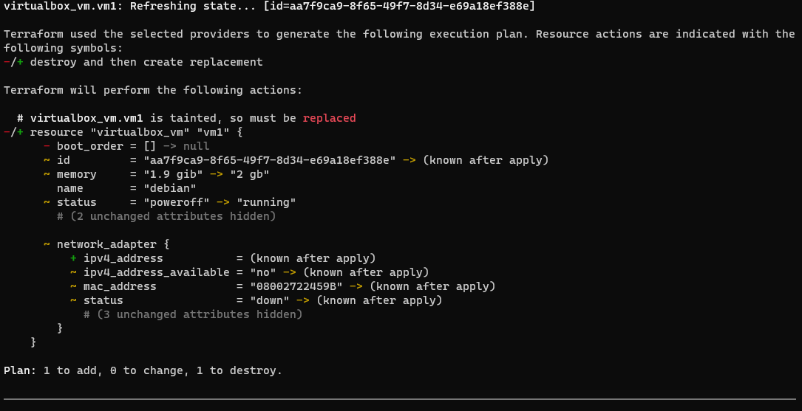
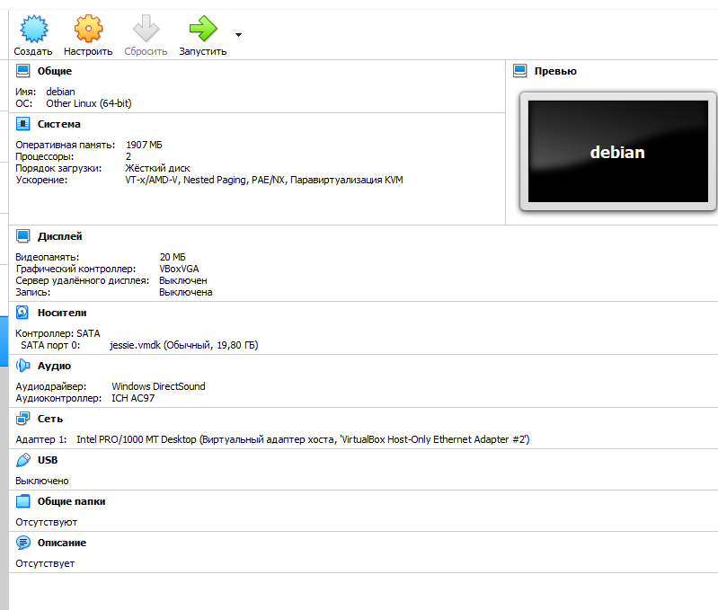

# Домашнее задание к занятию «Введение в Terraform»


### Задание 1

1. Перейдите в каталог [**src**](https://github.com/netology-code/ter-homeworks/tree/main/01/src). Скачайте все необходимые зависимости, использованные в проекте. 
2. Изучите файл **.gitignore**. В каком terraform файле согласно этому .gitignore допустимо сохранить личную, секретную информацию? 
`personal.auto.tfvars`
3. Выполните код проекта. Найдите  в State-файле секретное содержимое созданного ресурса **random_password**, пришлите в качестве ответа конкретный ключ и его значение.
`"result": "kvc21juzfcfm0YvY",`
4. Раскомментируйте блок кода, примерно расположенный на строчках 29-42 файла **main.tf**.
Выполните команду ```terraform validate```. Объясните в чем заключаются намеренно допущенные ошибки? Исправьте их.

* `В блоке ресурса docker_image отсутствует имя. Все блоки ресурсов должны иметь две метки (тип и имя).`

* `Имя ресурса docker_container должно начинаться с буквы или подчеркивания и может содержать только буквы, цифры, подчеркивания и дефисы. `

* `В блоке ресурса docker_container используется ссылка на ресурс docker_image.nginx, который не был объявлен в корневом модуле. Нужно предварительно объявить этот ресурс, чтобы использовать его в другом ресурсе.`

* `В блоке ресурса docker_container используется ссылка на ресурс random_password.random_string_fake, который также не был объявлен.`


5. Выполните код. В качестве ответа приложите вывод команды ```docker ps```
```bash
# docker ps -a
CONTAINER ID   IMAGE          COMMAND                  CREATED         STATUS         PORTS                  NAMES
7dc8e244142e   448a08f1d2f9   "/docker-entrypoint.…"   3 minutes ago   Up 2 minutes   0.0.0.0:8000->80/tcp   example_kvc21juzfcfm0YvY
```

6. Замените имя docker-контейнера в блоке кода на ```hello_world```, выполните команду ```terraform apply -auto-approve```.
Объясните своими словами, в чем может быть опасность применения ключа  ```-auto-approve``` ? В качестве ответа дополнительно приложите вывод команды ```docker ps```

Ключ -auto-approve в Terraform позволяет автоматически применять изменения без подтверждения. Это может быть опасно, потому что непреднамеренные ошибки или некорректные изменения могут привести к проблемам с инфраструктурой. Он также обходит контроль версий и делает процесс развертывания менее прозрачным, что может затруднить отслеживание и устранение проблем.

```bash
# docker ps -a
CONTAINER ID   IMAGE          COMMAND                  CREATED         STATUS         PORTS                  NAMES
053f76a9868c   448a08f1d2f9   "/docker-entrypoint.…"   8 minutes ago   Up 7 minutes   0.0.0.0:8000->80/tcp   hello-world

```

8. Уничтожьте созданные ресурсы с помощью **terraform**. Убедитесь, что все ресурсы удалены. Приложите содержимое файла **terraform.tfstate**. 

```
# cat terraform.tfstate
{
  "version": 4,
  "terraform_version": "1.4.6",
  "serial": 11,
  "lineage": "c1913c2b-029b-069e-6897-38282f61e58a",
  "outputs": {},
  "resources": [],
  "check_results": null
}

```

9. Объясните, почему при этом не был удален docker образ **nginx:latest** ? Ответ подкрепите выдержкой из документации провайдера.

Опция "keep_locally = " не была указана в описании ресурса. Она относится к удалению локальных копий файлов конфигурации Terraform после их применения. Когда значение установлено на "false", Terraform удалит локальные копии файлов после успешного применения изменений. После применения изменений Terraform не будет хранить локальные копии файлов конфигурации.

https://registry.terraform.io/providers/kreuzwerker/docker/latest/docs/resources/image#keep_locally


### Задание 2*

1. Изучите в документации provider [**Virtualbox**](https://registry.tfpla.net/providers/shekeriev/virtualbox/latest/docs/overview/index) от 
shekeriev.
2. Создайте с его помощью любую виртуальную машину. Чтобы не использовать VPN советуем выбрать любой образ с расположением в github из [**списка**](https://www.vagrantbox.es/)

В качестве ответа приложите plan для создаваемого ресурса и скриншот созданного в VB ресурса. 

------

