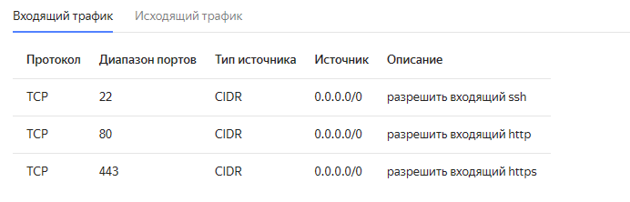
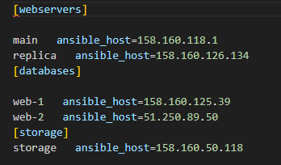
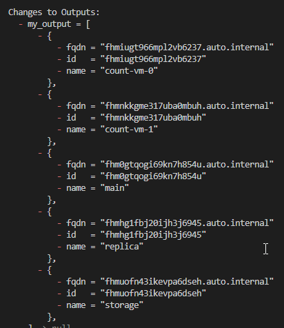
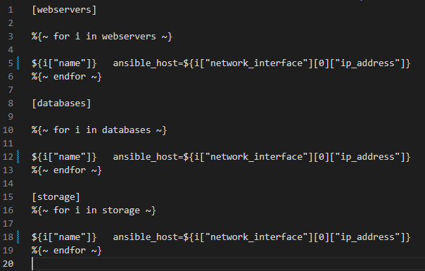

### Задание 1

1. Изучите проект.
2. Заполните файл personal.auto.tfvars.
3. Инициализируйте проект, выполните код. Он выполнится, даже если доступа к preview нет.

Примечание. Если у вас не активирован preview-доступ к функционалу «Группы безопасности» в Yandex Cloud, запросите доступ у поддержки облачного провайдера. Обычно его выдают в течение 24-х часов.

Приложите скриншот входящих правил «Группы безопасности» в ЛК Yandex Cloud или скриншот отказа в предоставлении доступа к preview-версии.


------

### Задание 2

1. Создайте файл count-vm.tf. Опишите в нём создание двух **одинаковых** ВМ  web-1 и web-2 (не web-0 и web-1) с минимальными параметрами, используя мета-аргумент **count loop**. Назначьте ВМ созданную в первом задании группу безопасности.(как это сделать узнайте в документации провайдера yandex/compute_instance )
2. Создайте файл for_each-vm.tf. Опишите в нём создание двух ВМ с именами "main" и "replica" **разных** по cpu/ram/disk , используя мета-аргумент **for_each loop**. Используйте для обеих ВМ одну общую переменную типа list(object({ vm_name=string, cpu=number, ram=number, disk=number  })). При желании внесите в переменную все возможные параметры.
3. ВМ из пункта 2.2 должны создаваться после создания ВМ из пункта 2.1.
4. Используйте функцию file в local-переменной для считывания ключа ~/.ssh/id_rsa.pub и его последующего использования в блоке metadata, взятому из ДЗ 2.
5. Инициализируйте проект, выполните код.

------

### Задание 3

1. Создайте 3 одинаковых виртуальных диска размером 1 Гб с помощью ресурса yandex_compute_disk и мета-аргумента count в файле **disk_vm.tf** .
2. Создайте в том же файле **одиночную**(использовать count или for_each запрещено из-за задания №4) ВМ c именем "storage"  . Используйте блок **dynamic secondary_disk{..}** и мета-аргумент for_each для подключения созданных вами дополнительных дисков.

------

### Задание 4

1. В файле ansible.tf создайте inventory-файл для ansible.
Используйте функцию tepmplatefile и файл-шаблон для создания ansible inventory-файла из лекции.
Готовый код возьмите из демонстрации к лекции [**demonstration2**](https://github.com/netology-code/ter-homeworks/tree/main/03/demonstration2).
Передайте в него в качестве переменных группы виртуальных машин из задания 2.1, 2.2 и 3.2, т. е. 5 ВМ.
2. Инвентарь должен содержать 3 группы [webservers], [databases], [storage] и быть динамическим, т. е. обработать как группу из 2-х ВМ, так и 999 ВМ.
4. Выполните код. Приложите скриншот получившегося файла. 



Для общего зачёта создайте в вашем GitHub-репозитории новую ветку terraform-03. Закоммитьте в эту ветку свой финальный код проекта, пришлите ссылку на коммит.   

https://github.com/alextonkovid/homework/tree/terraform-03

------

## Дополнительные задания (со звездочкой*)

**Настоятельно рекомендуем выполнять все задания со звёздочкой.** Они помогут глубже разобраться в материале.   
Задания со звёздочкой дополнительные, не обязательные к выполнению и никак не повлияют на получение вами зачёта по этому домашнему заданию. 

### Задание 5* (необязательное)
1. Напишите output, который отобразит все 5 созданных ВМ в виде списка словарей:
``` 
[
 {
  "name" = 'имя ВМ1'
  "id"   = 'идентификатор ВМ1'
  "fqdn" = 'Внутренний FQDN ВМ1'
 },
 {
  "name" = 'имя ВМ2'
  "id"   = 'идентификатор ВМ2'
  "fqdn" = 'Внутренний FQDN ВМ2'
 },
 ....
]
```
Приложите скриншот вывода команды ```terrafrom output```.

------

### Задание 6* (необязательное)

1. Используя null_resource и local-exec, примените ansible-playbook к ВМ из ansible inventory-файла.
Готовый код возьмите из демонстрации к лекции [**demonstration2**](https://github.com/netology-code/ter-homeworks/tree/main/demonstration2).
3. Дополните файл шаблон hosts.tftpl. 
Формат готового файла:
```netology-develop-platform-web-0   ansible_host="<внешний IP-address или внутренний IP-address если у ВМ отсутвует внешний адрес>"```

Для проверки работы уберите у ВМ внешние адреса. Этот вариант используется при работе через bastion-сервер.
Для зачёта предоставьте код вместе с основной частью задания.
 

