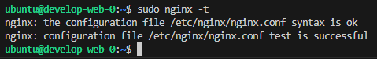
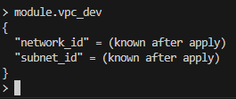
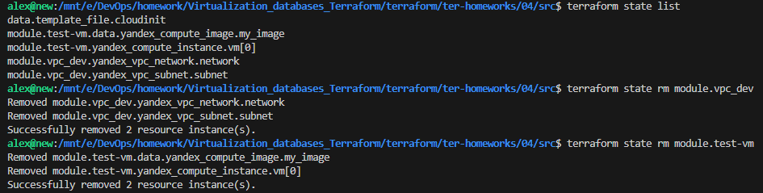
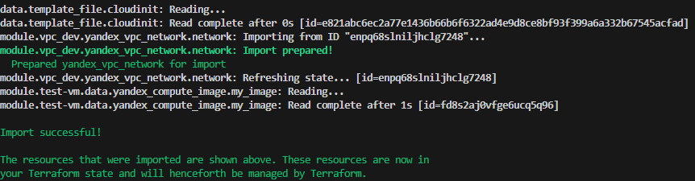
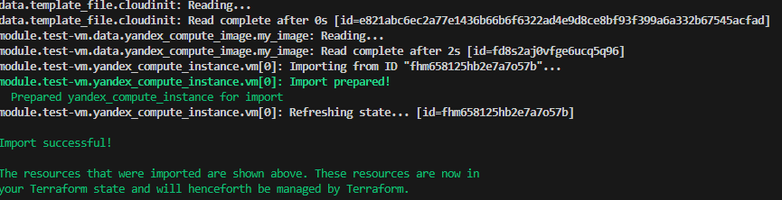
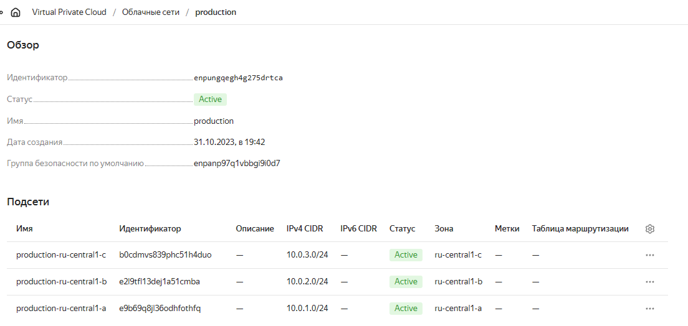
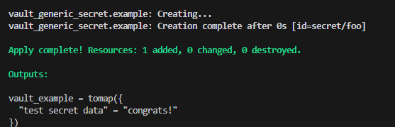

# Домашнее задание к занятию «Продвинутые методы работы с Terraform»

### Задание 1

1. Возьмите из [демонстрации к лекции готовый код](https://github.com/netology-code/ter-homeworks/tree/main/04/demonstration1) для создания ВМ с помощью remote-модуля.
2. Создайте одну ВМ, используя этот модуль. В файле cloud-init.yml необходимо использовать переменную для ssh-ключа вместо хардкода. Передайте ssh-ключ в функцию template_file в блоке vars ={} .
Воспользуйтесь [**примером**](https://grantorchard.com/dynamic-cloudinit-content-with-terraform-file-templates/). Обратите внимание, что ssh-authorized-keys принимает в себя список, а не строку.
3. Добавьте в файл cloud-init.yml установку nginx.
4. Предоставьте скриншот подключения к консоли и вывод команды ```sudo nginx -t```.

------

### Задание 2

1. Напишите локальный модуль vpc, который будет создавать 2 ресурса: **одну** сеть и **одну** подсеть в зоне, объявленной при вызове модуля, например: ```ru-central1-a```.
2. Вы должны передать в модуль переменные с названием сети, zone и v4_cidr_blocks.
3. Модуль должен возвращать в root module с помощью output информацию о yandex_vpc_subnet. Пришлите скриншот информации из terraform console о своем модуле. Пример: > module.vpc_dev  

4. Замените ресурсы yandex_vpc_network и yandex_vpc_subnet созданным модулем. Не забудьте передать необходимые параметры сети из модуля vpc в модуль с виртуальной машиной.
5. Откройте terraform console и предоставьте скриншот содержимого модуля. Пример: > module.vpc_dev.

6. Сгенерируйте документацию к модулю с помощью terraform-docs.    

 https://github.com/alextonkovid/homework/blob/master/Virtualization_databases_Terraform/terraform/ter-homeworks/04/src/README.md


### Задание 3
1. Выведите список ресурсов в стейте.
2. Полностью удалите из стейта модуль vpc.
3. Полностью удалите из стейта модуль vm.
4. Импортируйте всё обратно. Проверьте terraform plan. Изменений быть не должно.
Приложите список выполненных команд и скриншоты процессы.

```
$ terraform state show 'module.test-vm.yandex_compute_instance.vm[0]' | grep 'id'
    folder_id                 = "b1grdvp13hcnks1eruea"
    id                        = "fhm658125hb2e7a7o57b"
    platform_id               = "standard-v1"
        disk_id     = "fhm5kfnilmkac1hgdjok"
            image_id   = "fd8s2aj0vfge6ucq5q96"
        security_group_ids = []
        subnet_id          = "e9b8ogqpdf3jc7poe1rn"
```

`$ terraform import "module.vpc_dev.yandex_vpc_network.network" enpq68slniljhclg7248`

`$ terraform import "module.test-vm.yandex_compute_instance.vm[0]" fhm658125hb2e7a7o57b`



### Задание 4*

1. Измените модуль vpc так, чтобы он мог создать подсети во всех зонах доступности, переданных в переменной типа list(object) при вызове модуля.  
  
Пример вызова
```
module "vpc_prod" {
  source       = "./vpc"
  env_name     = "production"
  subnets = [
    { zone = "ru-central1-a", cidr = "10.0.1.0/24" },
    { zone = "ru-central1-b", cidr = "10.0.2.0/24" },
    { zone = "ru-central1-c", cidr = "10.0.3.0/24" },
  ]
}

module "vpc_dev" {
  source       = "./vpc"
  env_name     = "develop"
  subnets = [
    { zone = "ru-central1-a", cidr = "10.0.1.0/24" },
  ]
}
```

Предоставьте код, план выполнения, результат из консоли YC.
<details>
  <summary>terraform plan</summary>

   ```json
  # module.vpc_dev.yandex_vpc_network.this will be created
  + resource "yandex_vpc_network" "this" {
      + created_at                = (known after apply)
      + default_security_group_id = (known after apply)
      + folder_id                 = (known after apply)
      + id                        = (known after apply)
      + labels                    = (known after apply)
      + name                      = "develop"
      + subnet_ids                = (known after apply)
    }

  # module.vpc_dev.yandex_vpc_subnet.this["ru-central1-a"] will be created
  + resource "yandex_vpc_subnet" "this" {
      + created_at     = (known after apply)
      + folder_id      = (known after apply)
      + id             = (known after apply)
      + labels         = (known after apply)
      + name           = "develop-ru-central1-a"
      + network_id     = (known after apply)
      + v4_cidr_blocks = [
          + "10.0.1.0/24",
        ]
      + v6_cidr_blocks = (known after apply)
      + zone           = "ru-central1-a"
    }

  # module.vpc_prod.yandex_vpc_network.this will be created
  + resource "yandex_vpc_network" "this" {
      + created_at                = (known after apply)
      + default_security_group_id = (known after apply)
      + folder_id                 = (known after apply)
      + id                        = (known after apply)
      + labels                    = (known after apply)
      + name                      = "production"
      + subnet_ids                = (known after apply)
    }

  # module.vpc_prod.yandex_vpc_subnet.this["ru-central1-a"] will be created
  + resource "yandex_vpc_subnet" "this" {
      + created_at     = (known after apply)
      + folder_id      = (known after apply)
      + id             = (known after apply)
      + labels         = (known after apply)
      + name           = "production-ru-central1-a"
      + network_id     = (known after apply)
      + v4_cidr_blocks = [
          + "10.0.1.0/24",
        ]
      + v6_cidr_blocks = (known after apply)
      + zone           = "ru-central1-a"
    }

  # module.vpc_prod.yandex_vpc_subnet.this["ru-central1-b"] will be created
  + resource "yandex_vpc_subnet" "this" {
      + created_at     = (known after apply)
      + folder_id      = (known after apply)
      + id             = (known after apply)
      + labels         = (known after apply)
      + name           = "production-ru-central1-b"
      + network_id     = (known after apply)
      + v4_cidr_blocks = [
          + "10.0.2.0/24",
        ]
      + v6_cidr_blocks = (known after apply)
      + zone           = "ru-central1-b"
    }

  # module.vpc_prod.yandex_vpc_subnet.this["ru-central1-c"] will be created
  + resource "yandex_vpc_subnet" "this" {
      + created_at     = (known after apply)
      + folder_id      = (known after apply)
      + id             = (known after apply)
      + labels         = (known after apply)
      + name           = "production-ru-central1-c"
      + network_id     = (known after apply)
      + v4_cidr_blocks = [
          + "10.0.3.0/24",
        ]
      + v6_cidr_blocks = (known after apply)
      + zone           = "ru-central1-c"
    }
  ```
</details>




### Задание 6*

1. Разверните у себя локально vault, используя docker-compose.yml в проекте.
2. Для входа в web-интерфейс и авторизации terraform в vault используйте токен "education".
3. Создайте новый секрет по пути http://127.0.0.1:8200/ui/vault/secrets/secret/create
Path: example  
secret data key: test 
secret data value: congrats!  
4. Считайте этот секрет с помощью terraform и выведите его в output по примеру:
```
provider "vault" {
 address = "http://<IP_ADDRESS>:<PORT_NUMBER>"
 skip_tls_verify = true
 token = "education"
}
data "vault_generic_secret" "vault_example"{
 path = "secret/example"
}

output "vault_example" {
 value = "${nonsensitive(data.vault_generic_secret.vault_example.data)}"
} 

Можно обратиться не к словарю, а конкретному ключу:
terraform console: >nonsensitive(data.vault_generic_secret.vault_example.data.<имя ключа в секрете>)
```
5. Попробуйте самостоятельно разобраться в документации и записать новый секрет в vault с помощью terraform. 


