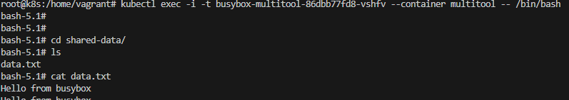
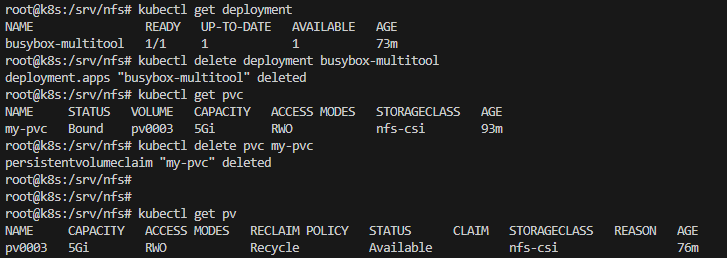
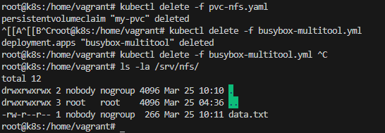
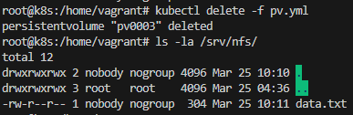
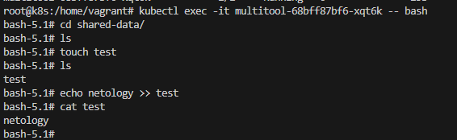

# Домашнее задание к занятию «Хранение в K8s. Часть 2»

### Цель задания

В тестовой среде Kubernetes нужно создать PV и продемострировать запись и хранение файлов.

------

### Дополнительные материалы для выполнения задания

1. [Инструкция по установке NFS в MicroK8S](https://microk8s.io/docs/nfs). 
2. [Описание Persistent Volumes](https://kubernetes.io/docs/concepts/storage/persistent-volumes/). 
3. [Описание динамического провижининга](https://kubernetes.io/docs/concepts/storage/dynamic-provisioning/). 
4. [Описание Multitool](https://github.com/wbitt/Network-MultiTool).

------

### Задание 1

**Что нужно сделать**

Создать Deployment приложения, использующего локальный PV, созданный вручную.

1. Создать Deployment приложения, состоящего из контейнеров busybox и multitool.
2. Создать PV и PVC для подключения папки на локальной ноде, которая будет использована в поде.
3. Продемонстрировать, что multitool может читать файл, в который busybox пишет каждые пять секунд в общей директории. 

4. Удалить Deployment и PVC. Продемонстрировать, что после этого произошло с PV. Пояснить, почему.

---

Когда PVC удаляется, само по себе это не влияет на PV. PV и PVC независимы друг от друга. 

После удаления PVC, PV остаётся нетронутым. PV будет доступен для привязки к новому PVC или может остаться без привязки до тех пор, пока не будет удален вручную администратором кластера. 

Однако в зависимости от настроек reclaim policy для PV, могут быть разные последствия:

- **Retain**: В этом случае, при удалении PVC, PV остается нетронутым, и администратор должен вручную освободить или переиспользовать ресурсы PV.
  
- **Delete**: При удалении PVC, PV может быть удален автоматически. Это означает, что после удаления PVC, PV также будет удален и ресурсы хранилища освобождаются.

- **Recycle**: Это политика, которая не очень популярна и в настоящее время находится в процессе удаления из Kubernetes. Она подразумевает удаление содержимого PV при удалении PVC, но на практике она не поддерживается многими хранилищами и может создавать потенциальные уязвимости в безопасности.

Таким образом, в зависимости от выбранной reclaim policy, после удаления PVC PV может оставаться доступным для привязки к другим PVC или быть удаленным вместе с его содержимым.

---

5. Продемонстрировать, что файл сохранился на локальном диске ноды. 

Удалить PV.  Продемонстрировать что произошло с файлом после удаления PV. Пояснить, почему.

Так как политика StorageClass nfs-csi равна reclaimPolicy: Retain файлы не удаляются после удаления PV

5. Предоставить манифесты, а также скриншоты или вывод необходимых команд.

- [busybox-multitool.yml](busybox-multitool.yml)
- [pv.yml](pv.yml) 
- [pvc-nfs.yaml](pvc-nfs.yaml)
- [sc-nfs.yaml](sc-nfs.yaml)

------

### Задание 2

**Что нужно сделать**

Создать Deployment приложения, которое может хранить файлы на NFS с динамическим созданием PV.

1. Включить и настроить NFS-сервер на MicroK8S.
2. Создать Deployment приложения состоящего из multitool, и подключить к нему PV, созданный автоматически на сервере NFS.
3. Продемонстрировать возможность чтения и записи файла изнутри пода. 
4. Предоставить манифесты, а также скриншоты или вывод необходимых команд.

[(multitool-dynamic.yml](multitool-dynamic.yml)
------

  
helper

  
curl https://raw.githubusercontent.com/helm/helm/master/scripts/get-helm-3 | bash

helm repo add stable https://charts.helm.sh/stable && helm repo update
helm install nfs-server stable/nfs-server-provisioner
sudo apt install nfs-common  -y

kubectl apply -f pvc.yaml
kubectl apply -f pod.yaml
apiVersion: v1
kind: Pod
metadata:
  name: local-nginx
spec:
  containers:
    - name: nginx
      image: nginx
      volumeMounts:
        - mountPath: "/static"
          name: my-volume
  volumes:
    - name: my-volume
      persistentVolumeClaim:
        claimName: task-pv-claim

apiVersion: v1
kind: PersistentVolume
metadata:
  name: task-pv-volume
spec:
  storageClassName: manual
  capacity:
    storage: 10Mi
  accessModes:
    - ReadWriteOnce
  hostPath:
    path: "/test"
apiVersion: v1
kind: PersistentVolumeClaim
metadata:
  name: task-pv-claim
spec:
  storageClassName: manual
  accessModes:
    - ReadWriteOnce
  resources:
    requests:
      storage: 10Mi
apiVersion: v1
kind: Pod
metadata:
  name: nginx
spec:
  containers:
    - name: nginx
      image: nginx
      volumeMounts:
        - mountPath: "/static"
          name: my-volume
  volumes:
    - name: my-volume
      persistentVolumeClaim:
        claimName: pvc
apiVersion: v1
kind: PersistentVolumeClaim
metadata:
  name: pvc
spec:
  storageClassName: "nfs"
  accessModes:
    - ReadWriteOnce
  resources:
    requests:
      storage: 10Mi

