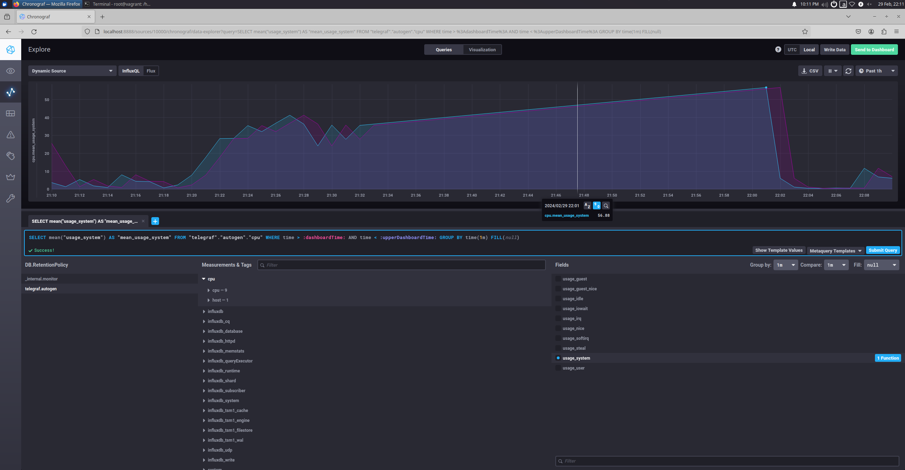

# Домашнее задание к занятию "13.Системы мониторинга"

## Обязательные задания

1. Вас пригласили настроить мониторинг на проект. На онбординге вам рассказали, что проект представляет из себя 
платформу для вычислений с выдачей текстовых отчетов, которые сохраняются на диск. Взаимодействие с платформой 
осуществляется по протоколу http. Также вам отметили, что вычисления загружают ЦПУ. Какой минимальный набор метрик вы
выведите в мониторинг и почему?

1. **Производительность HTTP-запросов:**
Среднее время ответа, процент успешных запросов, количество запросов в единицу времени.
Эти метрики позволят понять, насколько быстро платформа отвечает на запросы пользователей и какой процент запросов завершается успешно. Это важно для оценки производительности и качества обслуживания.

2. **Нагрузка на CPU:**
Загрузка CPU в процентах, количество активных потоков/процессов.
Учитывая, что вычисления загружают ЦПУ, важно отслеживать его загрузку для выявления возможных узких мест и предотвращения перегрузок, которые могут привести к сбоям и снижению производительности.

3. **Использование памяти:**
Общее использование памяти, использование виртуальной памяти, утечки памяти.
Эти метрики помогут выявить утечки памяти, оптимизировать использование ресурсов и предотвратить ситуации, когда приложение начинает использовать слишком много памяти, что может привести к снижению производительности или даже к аварийному завершению работы.

4. **Логи и ошибки:**
 Количество ошибок, уровень журналирования, критические события.
Мониторинг логов и ошибок позволит оперативно реагировать на проблемы и идентифицировать их причины для последующего исправления. Это поможет обеспечить стабильную работу приложения.

5. **Доступность системы:**
Время недоступности, процент времени работы системы, отказы в обслуживании.
Эти метрики позволят оценить доступность системы для пользователей и выявить проблемы в работе приложения или инфраструктуры, такие как сетевые сбои или проблемы с хостингом.


#
2. Менеджер продукта посмотрев на ваши метрики сказал, что ему непонятно что такое RAM/inodes/CPUla. Также он сказал, 
что хочет понимать, насколько мы выполняем свои обязанности перед клиентами и какое качество обслуживания. Что вы 
можете ему предложить?


1. **Availability Metrics:** Отслеживание времени доступности сервисов для клиентов.

2. **Response Time:** Измерение времени, необходимого для ответа на запросы клиентов.

3. **Customer Satisfaction:** Проведение опросов для оценки удовлетворенности качеством обслуживания.

4. **Error and Issue Monitoring:** Отслеживание количества ошибок и проблем, с которыми сталкиваются клиенты, и работа над их решением.

Эти метрики помогут нам оценить эффективность нашей работы и обеспечить высокое качество обслуживания для клиентов.


#
3. Вашей DevOps команде в этом году не выделили финансирование на построение системы сбора логов. Разработчики в свою 
очередь хотят видеть все ошибки, которые выдают их приложения. Какое решение вы можете предпринять в этой ситуации, 
чтобы разработчики получали ошибки приложения?


1. **Использование локального логирования:** Разработчики могут настроить локальное логирование в своих приложениях, чтобы записывать ошибки и события прямо на машине, где приложение работает. Это может включать в себя использование стандартных библиотек логирования для языка программирования, таких как Log4j для Java или Winston для Node.js.

2. **Уведомления об ошибках через мессенджеры:** Мы можем настроить систему уведомлений, которая будет отправлять сообщения разработчикам в мессенджеры (например, Slack или Microsoft Teams) при возникновении критических ошибок в приложении. Это позволит разработчикам быстро реагировать на проблемы, даже без прямого доступа к централизованным логам.

3. **Регулярные отчеты об ошибках:** Мы можем создать процесс формирования регулярных отчетов о возникших ошибках в приложениях и распространять их среди разработчиков. Это позволит им быть в курсе текущего состояния приложений и предпринимать необходимые действия для исправления проблем.

Хотя эти методы не заменяют полноценной системы сбора логов, они позволят разработчикам получать информацию о возникающих ошибках и продолжать работать над улучшением приложений.

#
4. Вы, как опытный SRE, сделали мониторинг, куда вывели отображения выполнения SLA=99% по http кодам ответов. 
Вычисляете этот параметр по следующей формуле: summ_2xx_requests/summ_all_requests. Данный параметр не поднимается выше 
70%, но при этом в вашей системе нет кодов ответа 5xx и 4xx. Где у вас ошибка?

1. **Метрики мониторинга:**
   - **CPU utilization (использование ЦПУ):** Поскольку вычисления загружают ЦПУ, этот параметр позволит отслеживать нагрузку на систему и предотвращать перегрузки.
   - **Потребление памяти (RAM):** Мониторинг RAM поможет выявить утечки памяти или неэффективное использование ресурсов.
   - **Коды HTTP-ответов:** Отслеживание количества успешных запросов (200 OK), а также ошибочных (4xx и 5xx), позволит оценить статус и работоспособность приложения.
   - **Объем хранимых отчетов:** Мониторинг дискового пространства для отчетов поможет предотвратить его переполнение.

2. **Метрики для мониторинга обязательств перед клиентами:**
   - **Время ответа на запросы:** Оценка времени, затрачиваемого на выполнение запросов, поможет понять, насколько оперативно обрабатываются запросы клиентов.
   - **Количество успешно сгенерированных отчетов:** Позволяет оценить выполнение основной функции системы.

3. **Решение для сбора ошибок приложения без финансирования на систему сбора логов:**
   - Воспользоваться бесплатными решениями сбора логов, такими как Elastic Stack (ELK), используя их базовые функциональности для сбора и анализа логов.
   - Использовать встроенные механизмы журналирования в приложении и настроить перенаправление логов в файлы или стандартный вывод, а затем мониторить эти логи с помощью простых скриптов или инструментов операционной системы.

4. **Ошибка в мониторинге SLA:**
   - Ошибка возникает из-за неправильного расчета формулы SLA. Параметр должен быть: summ_2xx_requests / summ_all_2xx_requests (количество успешных запросов / общее количество успешных запросов). Таким образом, SLA необходимо вычислять только для успешных запросов (коды ответа 2xx), а не для всех запросов в целом.


#
5. Опишите основные плюсы и минусы pull и push систем мониторинга.

### Pull система мониторинга:

#### Плюсы:
- **Меньшая нагрузка на целевые системы:** Мониторинговые агенты активно опрашивают целевые системы только при необходимости, что снижает нагрузку на них.
- **Простая настройка:** Подключение новых узлов к мониторингу проще, поскольку агенты на узлах самостоятельно обращаются к серверу мониторинга.
- **Более гибкий контроль за данными:** Позволяет более гибко контролировать, какие данные собирать и как часто.

#### Минусы:
- **Задержка в обнаружении проблем:** Из-за того, что агенты опрашивают целевые системы по расписанию, могут возникнуть задержки в обнаружении проблем.
- **Большая нагрузка на сервер мониторинга:** При большом количестве узлов, активно опрашивающих сервер мониторинга, может возникнуть высокая нагрузка на сервер.

### Push система мониторинга:

#### Плюсы:
- **Более быстрая реакция на события:** Данные отправляются на сервер мониторинга мгновенно по возникновении события, что позволяет быстрее реагировать на проблемы.
- **Меньшая нагрузка на сервер мониторинга:** Поскольку серверу мониторинга не нужно активно опрашивать узлы, это снижает его нагрузку.
- **Легче масштабировать:** При добавлении новых узлов нет необходимости настраивать каждый агент, так как они сами отправляют данные на сервер мониторинга.

#### Минусы:
- **Потенциальная потеря данных:** Если сервер мониторинга не сможет обработать поступающие данные из-за перегрузки или других причин, может произойти потеря данных.
- **Больший объем трафика:** Поскольку данные отправляются на сервер мониторинга мгновенно, это может привести к увеличению объема сетевого трафика.


#


6. Какие из ниже перечисленных систем относятся к push модели, а какие к pull? А может есть гибридные?

    - Prometheus 
    - TICK
    - Zabbix
    - VictoriaMetrics
    - Nagios


| Система мониторинга | Модель               |
|---------------------|----------------------|
| Prometheus          | Push                 |
| TICK                | Push                 |
| Zabbix              | Hybrid (Pull и Push) |
| VictoriaMetrics     | Push                 |
| Nagios              | Pull                 |
Prometheus, TICK и VictoriaMetrics основаны на push-модели, где метрики и данные мониторинга активно отправляются на сервер мониторинга. Zabbix является гибридной системой, так как она поддерживает как pull, так и push-модели мониторинга. Наконец, Nagios работает на pull-модели, где сервер мониторинга активно опрашивает узлы для получения данных о состоянии.
#


7. Склонируйте себе [репозиторий](https://github.com/influxdata/sandbox/tree/master) и запустите TICK-стэк, 
используя технологии docker и docker-compose.

В виде решения на это упражнение приведите скриншот веб-интерфейса ПО chronograf (`http://localhost:8888`). 

P.S.: если при запуске некоторые контейнеры будут падать с ошибкой - проставьте им режим `Z`, например
`./data:/var/lib:Z`
#
8. Перейдите в веб-интерфейс Chronograf (http://localhost:8888) и откройте вкладку Data explorer.
        
    - Нажмите на кнопку Add a query
    - Изучите вывод интерфейса и выберите БД telegraf.autogen
    - В `measurments` выберите cpu->host->telegraf-getting-started, а в `fields` выберите usage_system. Внизу появится график утилизации cpu.
    - Вверху вы можете увидеть запрос, аналогичный SQL-синтаксису. Поэкспериментируйте с запросом, попробуйте изменить группировку и интервал наблюдений.

Для выполнения задания приведите скриншот с отображением метрик утилизации cpu из веб-интерфейса.



#
9. Изучите список [telegraf inputs](https://github.com/influxdata/telegraf/tree/master/plugins/inputs). 
Добавьте в конфигурацию telegraf следующий плагин - [docker](https://github.com/influxdata/telegraf/tree/master/plugins/inputs/docker):
```
[[inputs.docker]]
  endpoint = "unix:///var/run/docker.sock"
```

Дополнительно вам может потребоваться донастройка контейнера telegraf в `docker-compose.yml` дополнительного volume и 
режима privileged:

useradd telegraf
sudo usermod -aG docker telegraf  
```
telegraf:
    # Full tag list: https://hub.docker.com/r/library/telegraf/tags/
    build:
      context: ./images/telegraf/
      dockerfile: ./${TYPE}/Dockerfile
      args:
        TELEGRAF_TAG: ${TELEGRAF_TAG}
    image: "telegraf"
    user: telegraf:994
    environment:
      HOSTNAME: "telegraf-getting-started"
    # Telegraf requires network access to InfluxDB
    links:
      - influxdb
    ports:
      - "8092:8092/udp"
      - "8094:8094"
      - "8125:8125/udp"
    volumes:
      # Mount for telegraf configuration
      - ./telegraf/:/etc/telegraf/
      # Mount for Docker API access
      - /var/run/docker.sock:/var/run/docker.sock
    depends_on:
      - influxdb
```

После настройке перезапустите telegraf, обновите веб интерфейс и приведите скриншотом список `measurments` в 
веб-интерфейсе базы telegraf.autogen . Там должны появиться метрики, связанные с docker.

Факультативно можете изучить какие метрики собирает telegraf после выполнения данного задания.


## Дополнительное задание (со звездочкой*) - необязательно к выполнению

1. Вы устроились на работу в стартап. На данный момент у вас нет возможности развернуть полноценную систему 
мониторинга, и вы решили самостоятельно написать простой python3-скрипт для сбора основных метрик сервера. Вы, как 
опытный системный-администратор, знаете, что системная информация сервера лежит в директории `/proc`. 
Также, вы знаете, что в системе Linux есть  планировщик задач cron, который может запускать задачи по расписанию.

Суммировав все, вы спроектировали приложение, которое:
- является python3 скриптом
- собирает метрики из папки `/proc`
- складывает метрики в файл 'YY-MM-DD-awesome-monitoring.log' в директорию /var/log 
(YY - год, MM - месяц, DD - день)
- каждый сбор метрик складывается в виде json-строки, в виде:
  + timestamp (временная метка, int, unixtimestamp)
  + metric_1 (метрика 1)
  + metric_2 (метрика 2)
  
     ...
     
  + metric_N (метрика N)
  
- сбор метрик происходит каждую 1 минуту по cron-расписанию

Для успешного выполнения задания нужно привести:

а) работающий код python3-скрипта,

б) конфигурацию cron-расписания,

в) пример верно сформированного 'YY-MM-DD-awesome-monitoring.log', имеющий не менее 5 записей,

P.S.: количество собираемых метрик должно быть не менее 4-х.
P.P.S.: по желанию можно себя не ограничивать только сбором метрик из `/proc`.

2. В веб-интерфейсе откройте вкладку `Dashboards`. Попробуйте создать свой dashboard с отображением:

    - утилизации ЦПУ
    - количества использованного RAM
    - утилизации пространства на дисках
    - количество поднятых контейнеров
    - аптайм
    - ...
    - фантазируйте)
    
    ---

### Как оформить ДЗ?

Выполненное домашнее задание пришлите ссылкой на .md-файл в вашем репозитории.

---

